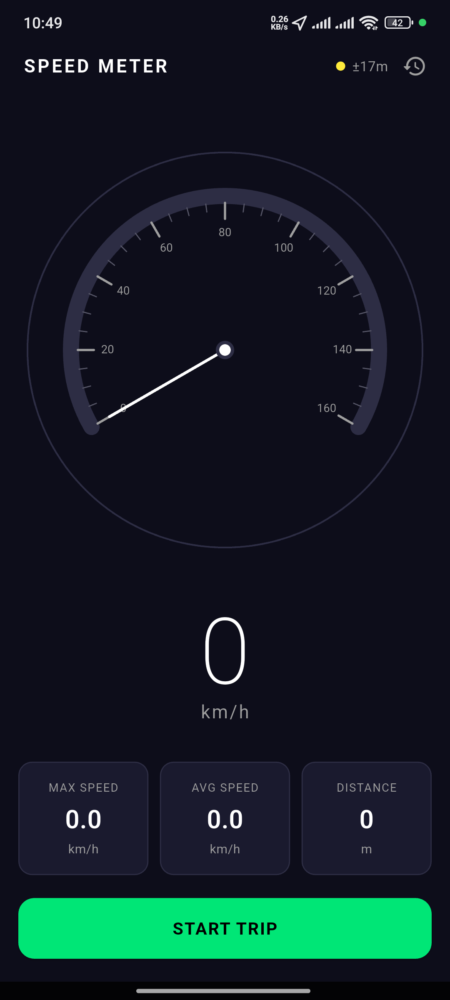
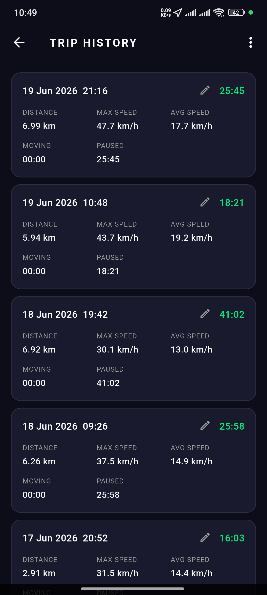

# Speed Meter

A Flutter GPS speedometer and trip recorder. Shows your live speed on a clean dial and records
trips with distance, speed stats, moving/paused time, and the route you took — all stored on the
device.

<p align="center">
  
  
</p>

## Features

- **Live speedometer** — real-time speed on a custom dial with a large km/h readout, fed by the
  GPS doppler speed with exponential smoothing (snaps fast on real acceleration, damps jitter
  while still).
- **GPS accuracy indicator** — color-coded dot and ±metre reading in the header.
- **Trip recording** — start/stop a trip to capture:
  - Distance travelled (displacement-based, with jump and jitter filtering)
  - Max and average speed
  - Elapsed time split into **moving** and **paused**
  - The route as a series of waypoints
- **Background tracking** — keeps recording while the screen is off or the app is backgrounded,
  via an Android foreground-service notification / iOS background location.
- **Trip history** — list of saved trips you can rename, delete, and open.
- **Route map** — view a recorded trip's path on an OpenStreetMap map.
- **Share & backup** — export all trips to a JSON file to share, and import trips back from JSON
  (duplicates are skipped on import).

All data is stored locally on the device — there is no account or server.

## Getting Started

Requires the [Flutter SDK](https://docs.flutter.dev/get-started/install) (Dart SDK ^3.11.5).

```bash
flutter pub get      # install dependencies
flutter run          # run on a connected device or emulator
```

Grant **location** permission when prompted. For reliable background recording, allow location
**"all the time"** and (on Android) allow the app's notification and exempt it from battery
optimization. On aggressive OEM skins (e.g. Xiaomi/MIUI) you must also enable *Autostart* and set
battery usage to *No restrictions* by hand.

## Build a release APK

```bash
./build.sh           # flutter clean + pub get + release APK (android-arm64)
```

The APK is written to `build/app/outputs/flutter-apk/`.

## Tech

Flutter • [geolocator](https://pub.dev/packages/geolocator) (GPS) •
[flutter_map](https://pub.dev/packages/flutter_map) + OpenStreetMap (route map) •
[shared_preferences](https://pub.dev/packages/shared_preferences) (storage) •
[share_plus](https://pub.dev/packages/share_plus) / [file_picker](https://pub.dev/packages/file_picker)
(export/import).

See [CLAUDE.md](CLAUDE.md) for architecture details.
